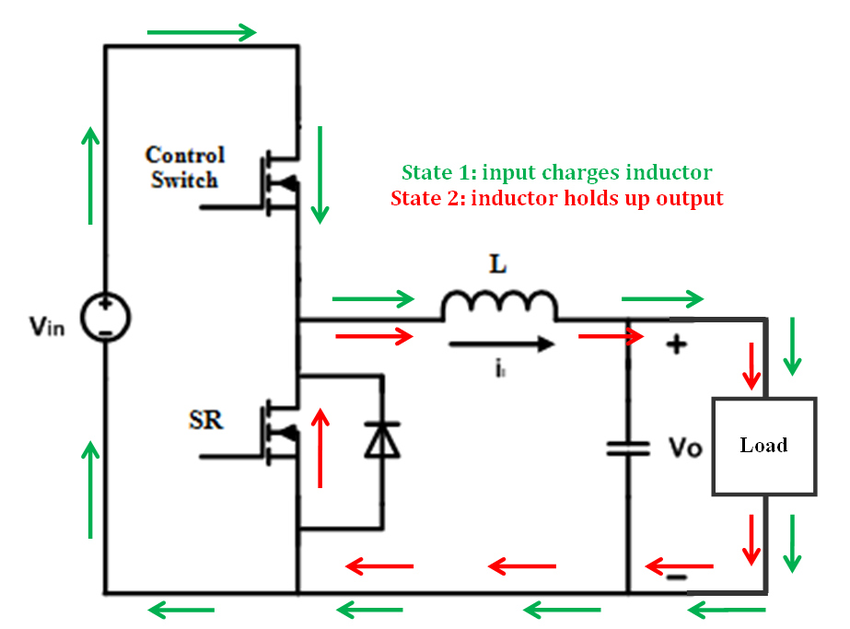
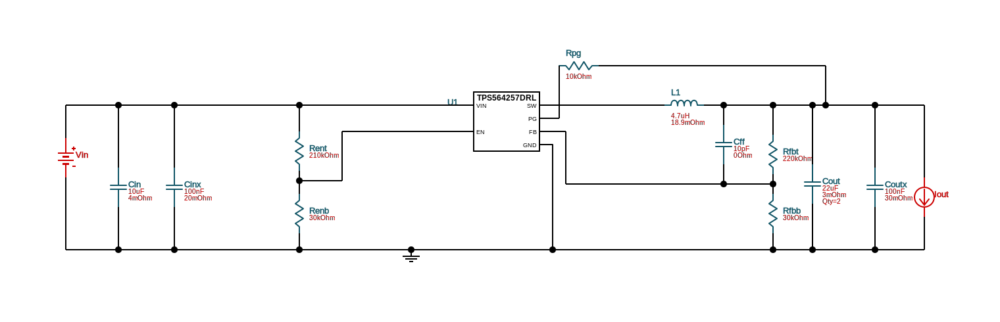
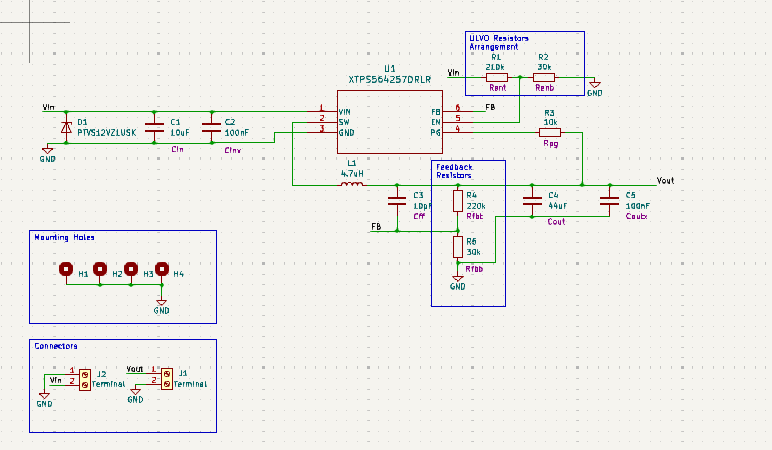
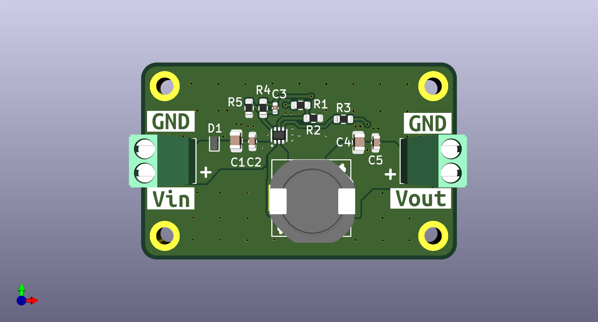

# buck-converter-design

This project focuses on the design and implementation of a **synchronous buck converter**, aiming for improved efficiency and reduced output ripple suitable for sensitive applications. The key aspect of the design is the careful selection of the **buck converter IC**, which plays a pivotal role in defining the overall performance, efficiency, and practicality of the system. Given the wide variety of ICs available, the process required in-depth research, tradeoff analysis, and simulation to select the most appropriate component.

## Introduction

A **buck converter** is a widely used DC-DC converter topology known for its simplicity and efficiency in stepping down voltage levels. However, the performance of a buck converter heavily depends on the **IC selected**, which determines parameters like efficiency, output ripple, switching frequency, and current handling capability.

In the early stages of this project, I explored various commercially available buck converter ICs. I started by reviewing the datasheet of the **LM2596-5V**, a commonly found and affordable buck converter IC used in general-purpose circuits. However, during the datasheet study, I realized that the LM2596 operates in **non-synchronous mode**, which uses an external diode in the freewheeling phase. This leads to higher losses, especially at lower output voltages or higher currents. And is also expensive.

Further research introduced me to the **synchronous buck converter topology**, where the freewheeling diode is replaced by a low-side MOSFET. This approach significantly improves efficiency by reducing diode losses, making it suitable for modern, high-performance applications where efficiency and thermal management are critical.

To assist in the selection process, I utilized **Texas Instruments' WEBENCH Designer**, an online tool that helps engineers simulate and optimize power supply designs based on their requirements. Using this tool, I evaluated various TI synchronous buck converter ICs, comparing parameters like efficiency, output current capability, switching frequency, and thermal performance.

## Theoretical Background

A **synchronous buck converter** is a type of step-down converter that replaces the freewheeling diode with a **low-side MOSFET**. It operates with two MOSFETs (high-side and low-side) and a PWM controller that ensures precise switching and dead-time management.

https://resources.pcb.cadence.com/blog/synchronous-vs-nonsynchronous-dc-dc-conversion

### How It Works:

- When the **high-side MOSFET** is ON, current flows from input → inductor → load → ground.
- When it's OFF, the **low-side MOSFET** turns ON and allows the inductor to continue supplying current (instead of using a diode).
- The **inductor** stores energy during the ON phase and releases it during the OFF phase, smoothing current.
- The **capacitor** filters voltage ripple and stabilizes output.

---

## Design Requirements

- Input Voltage Range: 10-14 VDC
- Output Voltage: 5V
- Output Continuous Current: 3A
- Switching Frequency: 600kHz
- Ripple Limits: \***\*2–3% of Vout i.e **0.02\*5 = 10mV\*\*
  [ Consumer / FCC Class B as per FCC Part 15 ]

### Components Selection

- Buck Converter IC:
  Used **TPS564257** because it supports a wide input range from 3V to 17V, which covers my system’s required 10V to 14V input. Its built-in enable threshold can be configured using external resistors to ensure the system only turns on when the input is above 10V, protecting against undervoltage. The converter also offers efficient performance at up to 4A output and includes safety features like overcurrent and thermal shutdown, making it a safe and compact solution for my power supply design.
- Inductor Value:
  Target inductor ripple current: **20% to 50% of output current (IOUT)**
  Use this to calculate **inductor value using the standard formula:**

$$
\Delta I_L = \frac{(V_{IN} - V_{OUT}) \times V_{OUT}}{V_{IN} \times L \times f_{SW}}
$$

$$
I_{L(PEAK)} = I_{OUT} + \frac{\Delta I_L}{2}
$$

And According to the datasheet the recommended Inductor Value is 4.7uH and calculating the current rating we came to know that the inductor should be able to handle around **4.2A.**

- Capacitor Value: The output capacitor value are also recommended in the datasheet as:
  $Cout$ ⇒ 44uF. And it should be able to handle the current as the following equation suggests and should have low ESR.
  And the input capacitor are $Cin$ = 10uF and an additional 100nF for high frequency filtering. And the Voltage rating should be greater than the Input Voltage range.

$$
I_{CO(RMS)} = \frac{V_{OUT} \times (V_{IN} - V_{OUT})}{\sqrt{12} \times V_{IN} \times L \times f_{SW}}
$$

### Output Voltage Calculation:

The output voltage is set by the help of voltage divider arrangement of the Rfbt and Rfbb resistors. The recommended Rfbt is 200kohm and Rfbb is 30kohm for setting the output to 5V. And for the voltage other than that we can set using this formula:

$$
V_{OUT} = 0.6V \times \left(1 + \frac{R_{FBT}}{R_{FBB}}\right)
$$

The datasheet recommends using 1% tolerance resistors and to improve efficiency at very light loads, consider using larger value resistors.

### UVLO (Under Voltage Lock Out)

The EN pin accepts the voltage from and using a series of resistors Rent and Renb the converter is only turned on when the input voltage is higher than 10V

**_Calculation for EN divider to turn ON at 10V:_**

$$
V_{EN} = V_{IN} \times \frac{RENB}{REN + RENB}
$$

$$
REN = RENB \times \left(\frac{V_{IN(ON)}}{V_{EN}} - 1\right)
$$

The $Ven$ is 1.19V and the $Renb$ should be in k ohm range and thus setting the $Renb$ ⇒ 30kohm will give $Ren$ ⇒ 210kohm.

### Reliability and Over Voltage Protection:

For adding the reliability of the buck converter and also to limit the upper voltage to around 14 V we added a TVS diode in parallel to to the input supply. The TVS diode is **PTVS12VZ1USK** to be exact.

### Circuit Design:

 

### PCB:

---

### Simulation:

Simulation of the circuit is done using **WEBENCH Power Designer**.

- [Startup Simulation](./Simulations/WBDesign_Startup-1.pdf)
- [Load Transient Simulation](./Simulations/WBDesign_Load%20Transient-2.pdf)
- [Input Transient Simulation](./Simulations/WBDesign_Input%20Transient-3.pdf)
- [Steady State Simulation](./Simulations/WBDesign_Steady%20State-4.pdf)

### References:

- [TI TPS564257 Buck Converter Datasheet](https://www.ti.com/lit/ds/symlink/tps564257.pdf)
- [WEBENCH Power Designer](https://webench.ti.com/power-designer/)
